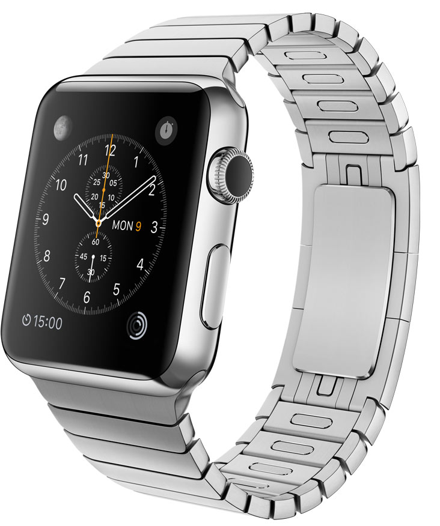

^Welcome everybody, we've got a great evening planned

---

#Sponsors

^First of all, I want to start by thanking our sponsors

^For this meetup, location, snacks and drinks are sponsored by Xebia. Xebia is looking for Mobile Full Stack Developers. If you want to know what they mean by that, or if you're interested in working for them, go talk to Lammert or Femke.

---

#Sponsors

^Egeniq has been a regular sponsor for some time now, but today we can announce that we have found a third regular sponsor

---

#Sponsors

 

^Framer Studio. Koen Bok an his team make awesome Mac App, if you haven't yet, go check it out.

^They are also looking for developers to join their team, so go talk to Jonas, and soon a vacancy will be posted to our job board.

---

#Agenda
- Xebia

- **Daniel Steinberg**

- *Xebia sponsored drinks in the bar*

^First Lammert from Xebia will tell you something about Xebia and what they do

^Then Daniel will give his talk 'Playing by a New Set of Rules'

^Afterwards there will be an open bar, sponsored by Xebia

---

#Want to give a talk?
##Contact us!

###foundation@cocoaheads.nl

^If you like to give a talk about something, just come talk to us, we always got room for speakers

^It doesn't have to be a long lecture, it can also be really short talk about something you found out recently or think is great

---

#Let's stay connected
- Slack team:
*http://cocoaheadsnl.slack.com*
(Ask Bart, Niels or Jeroen for an invite. We now have a self serve URL to register for our Slack)

- Facebook
*https://facebook.com/cocoaheadsnl*

- LinkedIN group:
*https://www.linkedin.com/groups/CocoaHeadsNL-7476559*

^To keep us connected between meetups, we have some platforms

^We have a Slack team (ask us for an invite), Facebook page and LinkedIN group, where you can keep in the loop about our activities

---

#Jobs
##http://jobs.cocoaheads.nl

^Our jobboard is growing rapidly with new opportunities for you guys, go have a look, there are some really great vacancies available, and some more will be added soon.

---

#Coming up

^So coming up, we have even more things scheduled in the upcoming months

---

# Apple Watch *hackathon*
## 6th of May, 10:00
- Whole day event
- Sanoma, Hoofddorp
- Organized by NU.nl

> Details on meetup.com

^NU.nl has invited us for an Apple Watch hackathon on the 6th of May

^It's an whole day event starting at 10 o'clock at Sanoma in Hoofddorp, food and drinks will be provided

^It's a great opportunity to prototype your own Apple Watch idea or play with nu.nl's content API

---

# Next regular meetup
## 20th of May, 18:00

- *Core Data in Modern Times* - Jorge Ortiz
- Backbase, Amsterdam

 
> Details on meetup.com

^Finally our next regular meetup will be at Backbase in Amsterdam, where Jorge Ortiz will give a talk about Core Data in Modern Times

^All of these events are also on meetup, so go check it out and RSVP!

---

^And now Lammert Westerhoff will fill you in on what Xebia is doing
