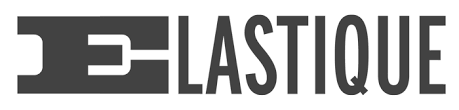

---

#sponsors
    

---

# Agenda for today

13.00 - 13.30 arrival
13.30 - 17.00 first sessions
17.00 - 18.00 dinner
18.00 - 22.30 second sessions
22.30 - 23.00 drinks

---

# housekeeping

- water, thee and koffie are included for free for first sessions
- dinner is included
- soda's, beer and other drinks are "fair use" and mostly covered by your ticket
- wifi password: gast - gast

---

#Next meetup: 

- 13th of July
- start wil be at 19.00
- Details: our app or on meetup.com

---

#Come and give a talk
##Contact:
- @CocoaHeadsNL
- @leenarts (Jeroen Leenarts)
- @nvh (Niels van Hoorn)
- @barthoffman
- @sidneydekoning

---

