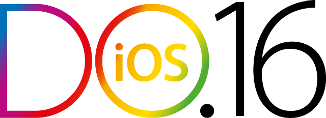

theme: Plain Jane, 0

---

#A special thanks for todays sponsor: 

---

#Welcome to CocoaHeads: 

- CocoaHeads NL is a monthly meeting of iOS and Mac developers in the Netherlands and part of the international CocoaHeads meetups. We discuss anything Apple, Cocoa, Objective-C, Swift and relevant technologies.

---

#sponsors

 
 

---

#Conference Nov. 15 / Training day Nov. 16 / CFP open till Sept. 12
###Currently early bird tickets We will get a CocoaHeadsNL code, but this is a better deal
###http://do-ios.com 
###Twitter: @iosconf / #doios2016

---

# Agenda for today

18.00 - 19.00 dinner
19.00 - 19.10 intro 
19.10 - 19.55 first session - Bas - Indoor positioning
19.55 - 20.15 break
20.15 - 21.00 second session - Menno - MVVM
21.00 - 21.30 finish 

---

#Next meetup: 

- 21st of September
- start wil be at 18.00
- Details: our app or on meetup.com

---

#Come and give a talk
##Contact:
- @CocoaHeadsNL
- @leenarts (Jeroen Leenarts)
- @nvh (Niels van Hoorn)
- @barthoffman
- @sidneydekoning

---

---

