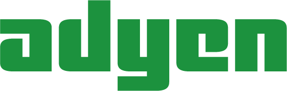

theme: Plain Jane, 0

---

#A special thanks for todays sponsors: 

---

#Welcome to CocoaHeads: 

- CocoaHeads NL is a monthly meeting of iOS and Mac developers in the Netherlands and part of the international CocoaHeads meetups. We discuss anything Apple, Cocoa, Objective-C, Swift and relevant technologies.

---

#sponsors
   

---

#Meetup at our sponsors: 

- same agenda as today
- talks from the community
- at our sponsors / occasionally larger as today

---

# Agenda for today

18.00 - 19.00 dinner
19.00 - 19.10 intro 
19.10 - 19.55 first session - Niels van Hoorn
19.55 - 20.15 break
20.15 - 21.00 second session - Aaron Hillegass
21.00 - 21.30 finish 

---

#Next meetup: 

- 24th of August
- start wil be at 18.00
- Details: our app or on meetup.com

---

#New meetup: 

- 21st of September
- start wil be at 18.00
- Details: our app or on meetup.com

---

#Come and give a talk
##Contact:
- @CocoaHeadsNL
- @leenarts (Jeroen Leenarts)
- @nvh (Niels van Hoorn)
- @barthoffman
- @sidneydekoning

---

---

