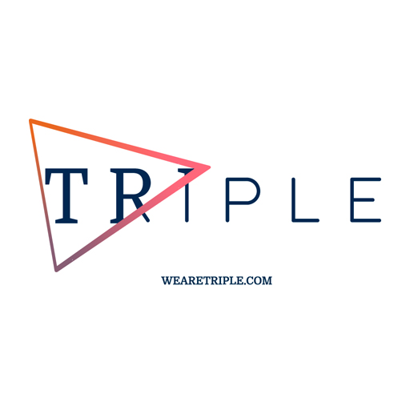

theme: Plain Jane, 0
 

---

#A special thanks for todays sponsor: 

---

- A monthly meetup of developers
- Part of the international CocoaHeads meetups
- Anything Apple, Cocoa, Objective-C, Swift and relevant technologies.

---

#sponsors

---

# Nov. 15 / Nov. 16
##Discount code: DOIOS_COCOAHEADSNL

###http://do-ios.com / Twitter: @iosconf / #doios2016

---

#Next meetup: Triple Alkmaar 

- November 9
- Alkmaar
- Doors open 18:00, talks start at 19:00
- Details: our app or on meetup.com (http://bit.ly/cocoaheadsnl)

---

# Agenda for today

- **18.30 - 19:00** Welcome  

- **19.00 - 19.45** Roadmap (@roadmaptravel) will talk about their challenges in automating the branding and release process for their own apps.

- **20:15 - 21:00** Sidney de Koning (@iheartswiftlang) will present about the most hated IDE in the world - Xcode. And he will show how to make a custom plugin for it.

- **21:00 - 21:30** Drinks

---

---

