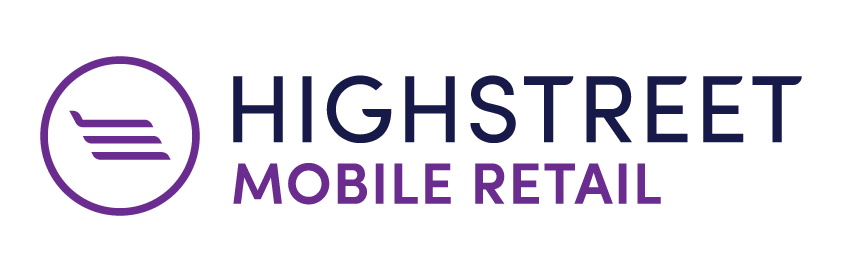

theme: Plain Jane, 0
 

---

- A monthly meetup of developers
- Part of the international CocoaHeads meetups
- Anything Apple, Cocoa, Objective-C, Swift and relevant technologies.

---

---

#A special thanks for today's sponsor:

---

#sponsors

---

#Also have a look at

This Thursday & Friday, Pathé Arena
Discount code, 10% off: c0c04h34d5
(Please only share with CocoaHeads)

Details: our app or on meetup.com (http://bit.ly/cocoaheadsnl)

---

#Next meetup: Minddistrict

April 20
Amsterdam
Doors open 18:00
Details: our app or on meetup.com (http://bit.ly/cocoaheadsnl)

---

# Agenda for today

- Welcome by Thomas from Highstreet
- Robert-Hein & Toine: *Interactive ViewController Transitions*
- Short break
- Paweł: *Behavior Driven Development*
- Drinks!

---

