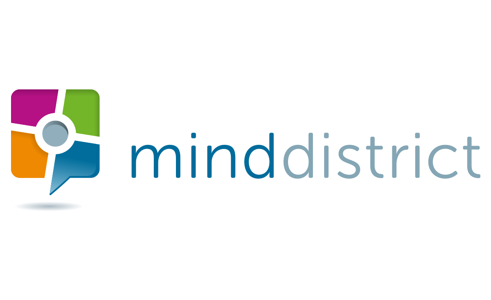

theme: Plain Jane, 0
 

---

- A monthly meetup of developers
- Part of the international CocoaHeads meetups
- Anything Apple, Cocoa, Objective-C, Swift and relevant technologies.

---

---

#A special thanks for today's sponsor:

---

#sponsors

---

#Next meetup: Mobiquity

May 18
Amsterdam
Doors open 18:00
Details: our app or on meetup.com (http://bit.ly/cocoaheadsnl)

---

#Food by

---

# Agenda for today

- Welcome by MindDistrict
- Tikitu de Jager: *MVVM + reactive = bliss*
- Short break
- Joost Diepenmaat: *The ins- and outs of using Turbolinks to build scalable hybrid apps*
- Drinks!

---

# 3 experiments

- Lots of people in this room?
- Food by Yumler
- Remote presentation from Greece

---

