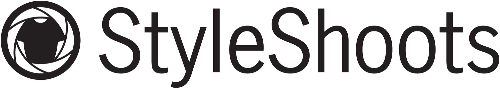
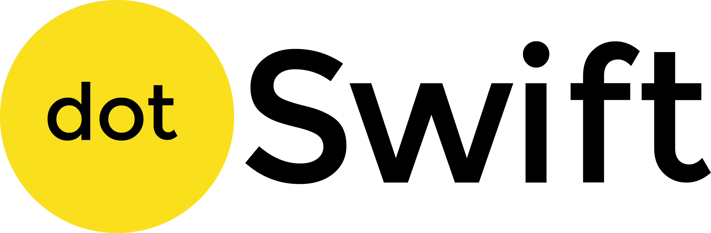
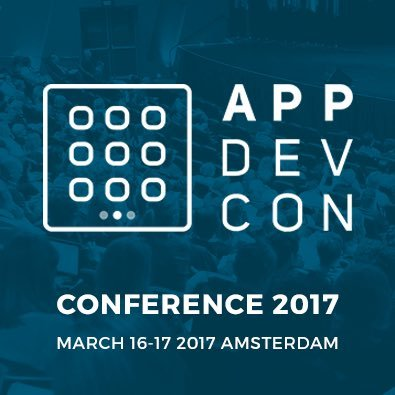

theme: Plain Jane, 0
 

---

#A special thanks for today's sponsor: 

---

- A monthly meetup of developers
- Part of the international CocoaHeads meetups
- Anything Apple, Cocoa, Objective-C, Swift and relevant technologies.

---

#sponsors

---

#Next meetup: Ice Mobile

- Februari 15
- Amsterdam
- Doors open 18:00
- Details: our app or on meetup.com (http://bit.ly/cocoaheadsnl)

---

#Also have a look at

##20% discount code

Details: our app or on meetup.com (http://bit.ly/cocoaheadsnl)

---

#And

Ask us for discount code. (Slack / meetup / email)

Details: our app or on meetup.com (http://bit.ly/cocoaheadsnl)

---

# Agenda for today

- **18.30 - 19:00** Welcome  

- **19.00 - 19.30** Presentation by Styleshoots

- **20:00 - 21:30** Alick Dykan will present about Working with type safe JSON models in Swift

- **20:30** Drinks

---

---

