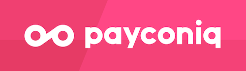
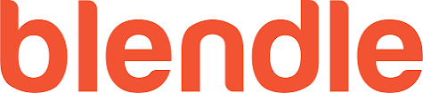

theme: Plain Jane, 0
 

---

- A monthly meetup of developers
- Part of the international CocoaHeads meetups
- Anything Apple, Cocoa, Objective-C, Swift and relevant technologies.

---

---

#A special thanks for today's sponsor:

---

#sponsors

---
#new sponsor

---

#Next meetup: Blendle

August 23th
HQ in Utrecht
Doors open 18:00
Details: our app or on meetup.com (http://bit.ly/cocoaheadsnl)

---

# Agenda for today

- Welcome at CocoaheadsNL
- Building the new WeTransfer app
- Break
- Automate all things

---

# Reminder

- In case of questions ask!
- New jobs on the board
- RSVP open now

See you at Blendle?

---

