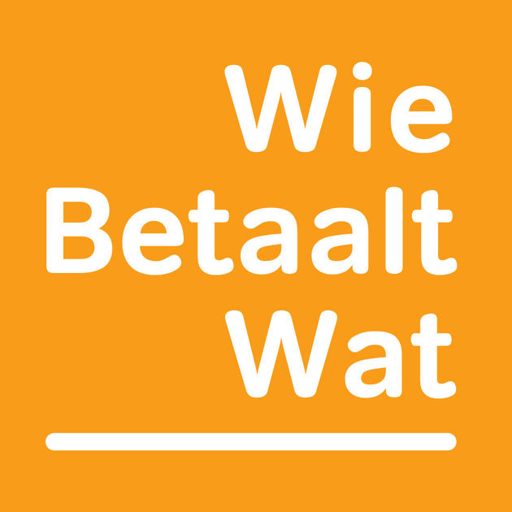
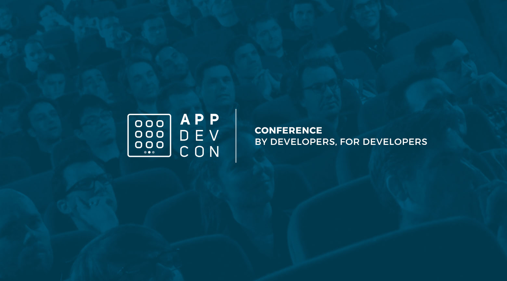

theme: Plain Jane, 0
 

---

- A monthly meetup of developers
- Part of the international CocoaHeads meetups
- Anything Apple, Cocoa, Objective-C, Swift and relevant technologies.

---

---

#sponsors

---

#A special thanks for today's sponsor:

---

# Agenda for today

- **Ellen Shapiro** (@designatednerd) will talk about het experience in giving talks and what it takes to prepare one. Ellen has given numerous presentations at various events and likes to share the most importants lessons learned.
- Break
- **Lammert Westerhoff** will present and give a live demo about serverless architecture for iOS apps with AWS API Gateway and AWS Lambda. And then using the Swagger file from the API Gateway to generate an API client in Swift.
- Drinks

---

# Next meetup announuced soon: Xebia

- Februari 14
- Hilversum
- Doors open 18:00
- Details: our app or on meetup.com (http://bit.ly/cocoaheadsnl)

---

#Also have a look at

March 15 & 16, Pathé Arena
Discount code, 10% off? Ask on our Slack channel (Please only share with CocoaHeads)

---

# Extra meetup announced soon:

---

# Reminder

- In case of questions ask!
- Recorded session will be on our vimeo: vimeo.com/cocoaheadsnl
- New jobs on the board: jobs.cocoaheads.nl

See you next month?

---

