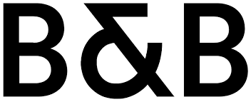

theme: Plain Jane, 0
 

---

- A monthly meetup of developers
- Part of the international CocoaHeads meetups
- Anything Apple, Cocoa, Objective-C, Swift and relevant technologies.

---

---

#sponsors

---

#A special thanks for today's sponsor:

---

# Agenda for today

- **Marijn Schilling** Introduction Bakken en Baeck
- **Robert-Hein Hooijmans**  Create a 3D game with Swift, in 2 days...
- **Ellen Shapiro** Kotlin For Swift Developers

---

# Next meetup April 25: Sogeti

- April 25th
- Amersfoort
- Doors open 18.00
- Details: our app or on meetup.com (http://bit.ly/cocoaheadsnl)

---

# Reminder

- In case of questions ask!
- Did you download the Apple TV App yet?: cocoaheads.nl/videos
- New jobs on the board: cocoaheads.nl/jobs

See you next time!

---

