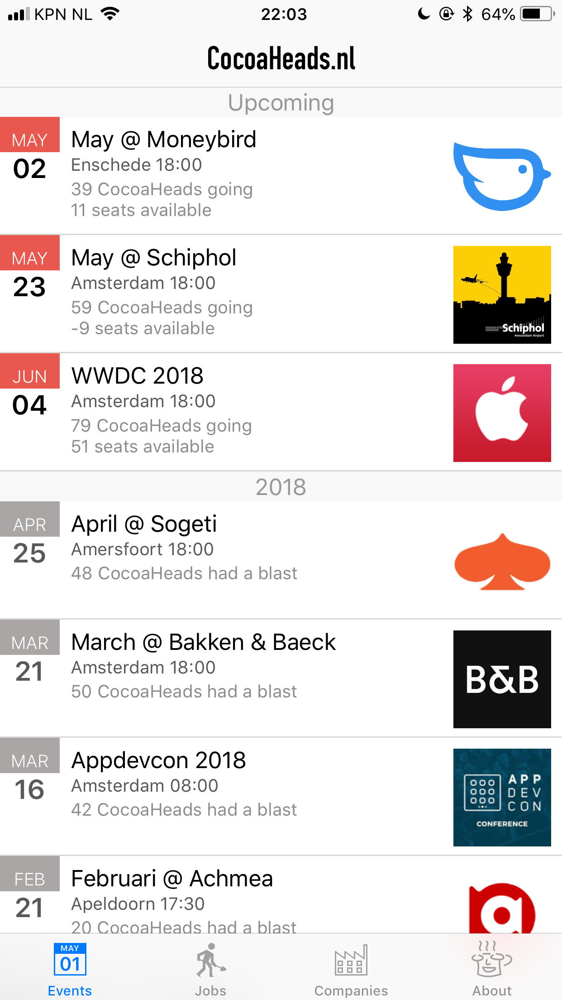
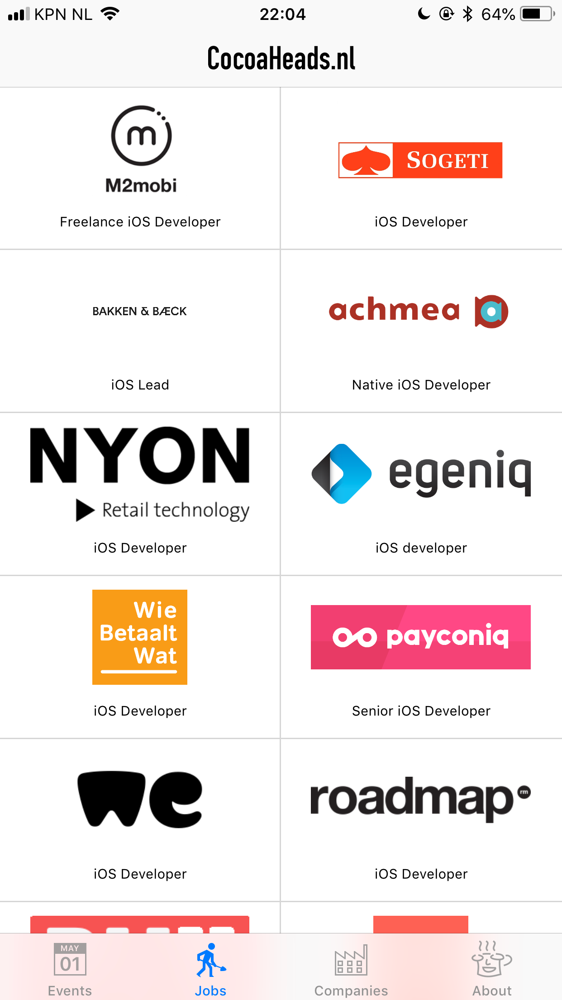
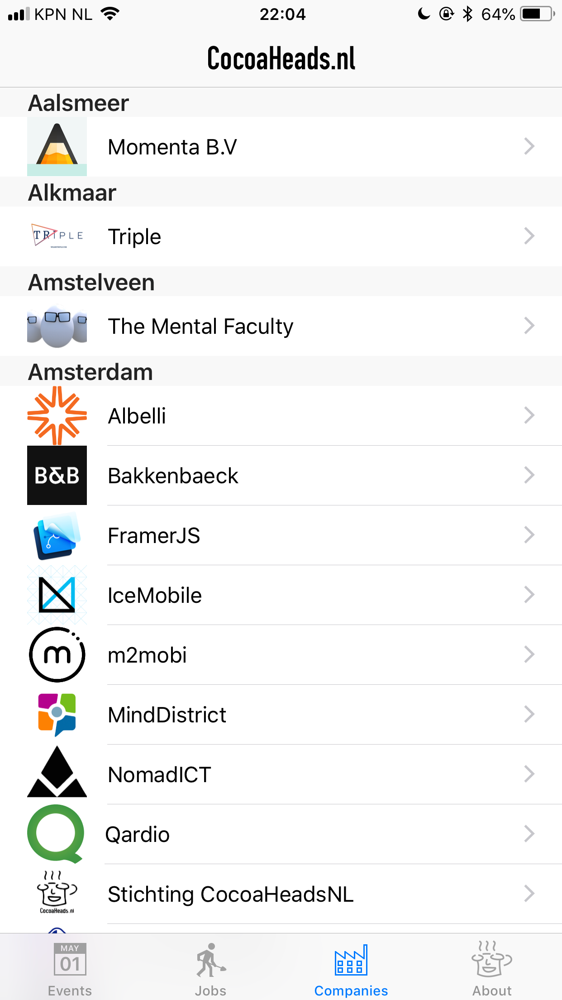
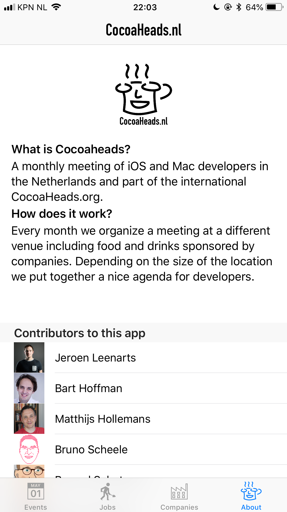
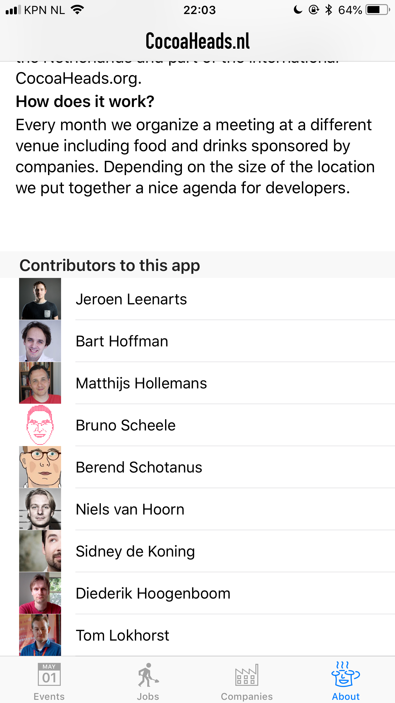
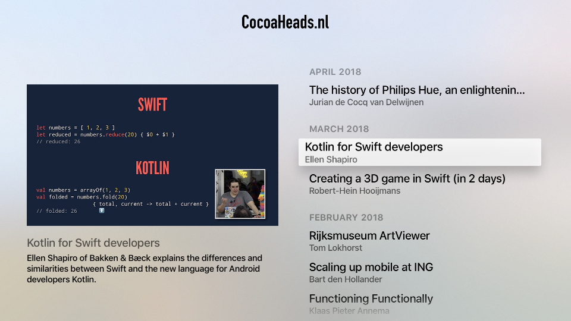

theme: Plain Jane, 0
 

---

 

---

# About me

- Software developer since 2002
- iOS since SDK version 3
- Worked on several apps B2C, B2B
  - ING Banking, Nyon, Achmea, SurfNet, Multiple small apps
  - **CocoaHeadsNL apps**
  
---

# About CocoaHeadsNL
- Running CocoaHeadsNL since July 2013
  - Took over from Peter Robinett
  - Januari 2014 Niels and Bart joined
  - February 2015 we registered as a non profit
  - Through Meetup.com we ran 68 meetups.
  - We have our schedule filled for over 12 months into the future

---

- A monthly meetup of developers
- Part of the international CocoaHeads meetups
- Anything Apple, Cocoa, Objective-C, Swift and relevant technologies.

---

# Details: our app or on meetup.com (http://bit.ly/cocoaheadsnl)

---

# iOS App

---

## Upcoming meetups

---

## Job posts

---

## Companies we are aware of

---

## About the app

---

## ... and those who contributed

---

## Backed by

- [CloudKit](https://icloud.developer.apple.com/dashboard/#containers/iCloud.nl.cocoaheads.app.CocoaHeadsNL/environments/Production/usage) filled by an [AWS Lambda function](https://eu-west-1.console.aws.amazon.com/lambda/home), that scrapes:
  - [Meetup API](https://www.meetup.com/meetup_api/)
  - RSS feed of [jobs](https://jobs.cocoaheads.nl)
  - [Github](https://developer.github.com/v3/)
  - Companies we enter manually on the CloudKit dashboard.

---

# tvOS App

---

---

# All code opensource
#### [https://github.com/CocoaHeadsNL/CocoaHeadsNL-tvOS](https://github.com/CocoaHeadsNL/CocoaHeadsNL-tvOS)
#### [https://github.com/CocoaHeadsNL/CocoaHeadsNL-iOS](https://github.com/CocoaHeadsNL/CocoaHeadsNL-iOS)
#### [https://github.com/CocoaHeadsNL/app-lambda-serverless](https://github.com/CocoaHeadsNL/app-lambda-serverless)

---

# Attribution-NonCommercial 4.0 International

- Compatible with App Store. In line with our foundation's goals

---

# All contributions are considered to be donations to CocoaheadsNL

- If you can not agree to this, then do no request a pull
- You will be attributed.

---

# Some of our ideas, things needing work

- License across all our code projects
- Better functioning sync... Current Lambda really is a horrible hack job...
- Push notifications
- Meetup API oAuth login and RSVP-ing in App
- Self serve management of companies (web app or in app)

