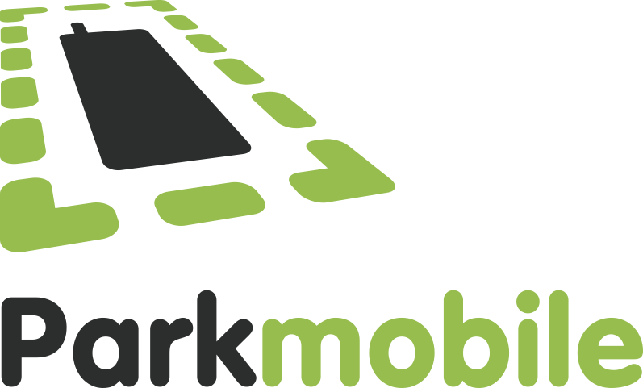
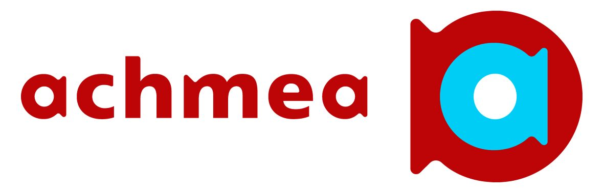

theme: Plain Jane, 0
 

---

- A monthly meetup of developers
- Part of the international CocoaHeads meetups
- Anything Apple, Cocoa, Objective-C, Swift and relevant technologies.

---

---

#sponsors

---

#A special thanks for today's sponsor:

---

# Agenda for today

- **Maria Postupaeva** Payconiq Clean Architecture
- **Dmitrii Ivanov** Core data in production

---

# Next meetup September 12

- Delft
- Doors open 18.00
- Details: our app or on meetup.com (http://bit.ly/cocoaheadsnl)

---

# November 2
## Conference day first speaker announced

^ Daniel Steinberg, 149 euros

---

# November 1
## University day: Get the most from functional programming in Swift

^ Daniel Steinberg, 220 euros, ADVANCED SWIFT

---
# Reminder

- Did you download the Apple TV App yet?: cocoaheads.nl/videos
- New jobs on the board: cocoaheads.nl/jobs

See you next time!

---

