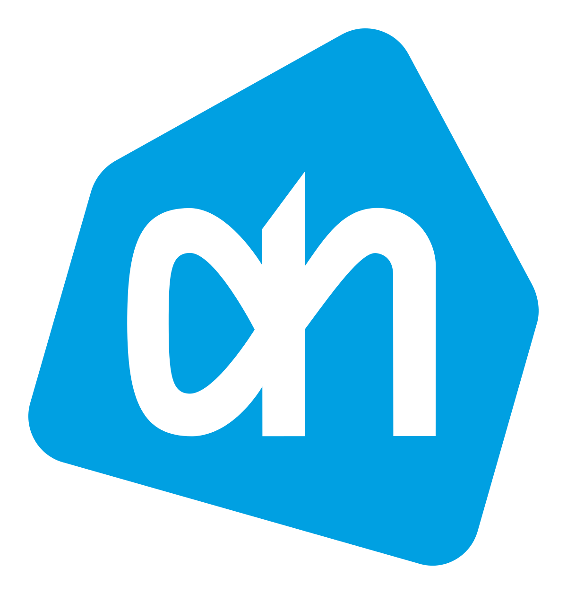

theme: Plain Jane, 0
 

---

- A monthly meetup of developers
- Part of the international CocoaHeads meetups
- Anything Apple, Cocoa, Objective-C, Swift and relevant technologies.

---

---

#sponsors

 
 
  

---

#A special thanks for today's sponsor:

---

# Agenda for today

- **Jeroen Bouma - Albert Heijn** 
- **Stijn Spijker and Sander van Tulden - Flitsmeister** 

---

# Next meetup December 19

- Amsterdam
- Doors open 18.00
- Details: our app or on meetup.com (http://bit.ly/cocoaheadsnl)

---

# Reminder

- Did you download the Apple TV App yet?: cocoaheads.nl/videos
- New jobs on the board: cocoaheads.nl/jobs

See you next time!

---

