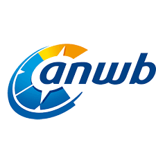
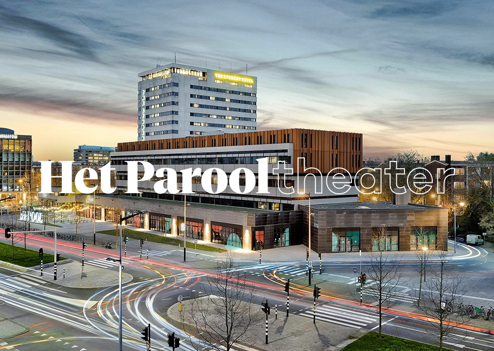

theme: Plain Jane, 0
 

---

- A monthly meetup of developers
- Part of the international CocoaHeads meetups
- Anything Apple, Cocoa, Objective-C, Swift and relevant technologies.

---

---

#sponsors

 
 
  

---

#A special thanks for today's sponsor:

---

# Agenda for today

- **Lammert Westerhof** Rx Driven Development
- **Dmittri Ivanov** Native serialisation in iOS

---

# Next meetup June 3: WWDC

- June 3
- Amsterdam
- Doors open 18.00
- Details: our app or on meetup.com (http://bit.ly/cocoaheadsnl)

---

# Reminder

- Did you download the Apple TV App yet?: cocoaheads.nl/videos
- New jobs on the board: cocoaheads.nl/jobs

See you next time!

---

