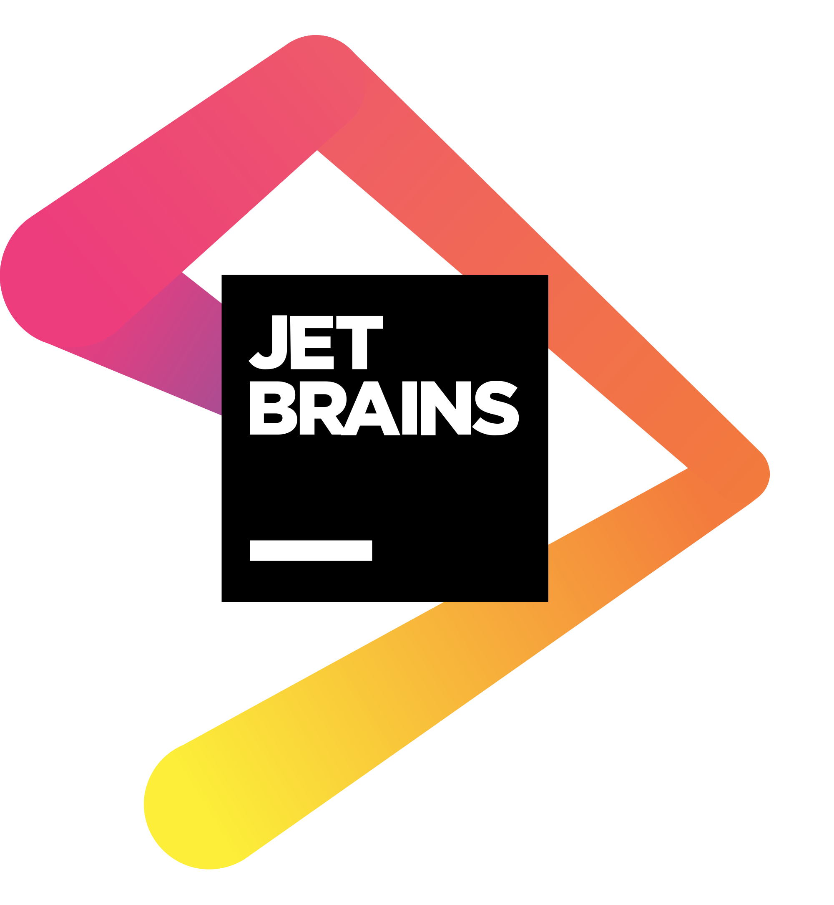

theme: Plain Jane, 0
 

---

- A monthly meetup of developers
- Part of the international CocoaHeads meetups
- Anything Apple, Cocoa, Objective-C, Swift and relevant technologies.

---

# Sponsors

  

 
  

---

---

# Win a JetBrains product coupon code

### Join us on Slack in #meetups and enter the raffle.

## Slack invite link: https://bit.ly/2zetXaO

---

# Agenda for today

###**Maxim Tsvetkov**
##Using Core NFC to scan and verify identity documents

Since iOS 13 you are able to read ID cards and passports.
Discover what is possible with the system iOS framework and what you need to add on top of it to scan and verify identity documents. Which data you can extract from documents and how you can verify the authenticity of these documents. And, of course, see a live demo of scanning a real ID as well.

---

# Next time

## January 20th

A talk by one of the developers of our new Silver sponsor

---

# Reminder

- Did you download the Apple TV App yet?: cocoaheads.nl/videos
- Subscribe on YouTube: https://youtube.com/stichtingcocoaheadsnl
- New jobs on the board: https://cocoaheads.nl/jobs
- Sign up to our newsletter at https://cocoaheads.nl

See you next time!

---

