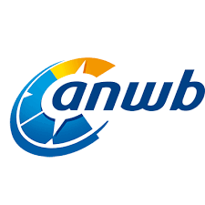
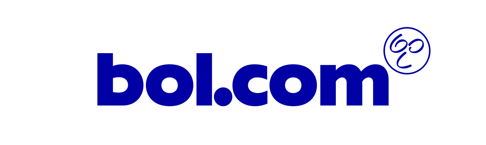

theme: Plain Jane, 0

---

- A monthly meetup of developers
- Part of the international CocoaHeads meetups
- Anything Apple, Cocoa, Objective-C, Swift and relevant technologies.

---

# #coronavirus

                          
####Photo: Claire Mueller (Unsplash)

---

# Talk of Jon Reid cancelled

---

# Sponsors

 
  

---

---

# Next meetup:

- 22nd of April
- Utrecht
- Please watch upcoming anouncements and details in our app or on meetup.com (http://bit.ly/cocoaheadsnl)

---

# Agenda for today

- **Antoine van der Lee**
  Asynchronous programming with operations in Swift
