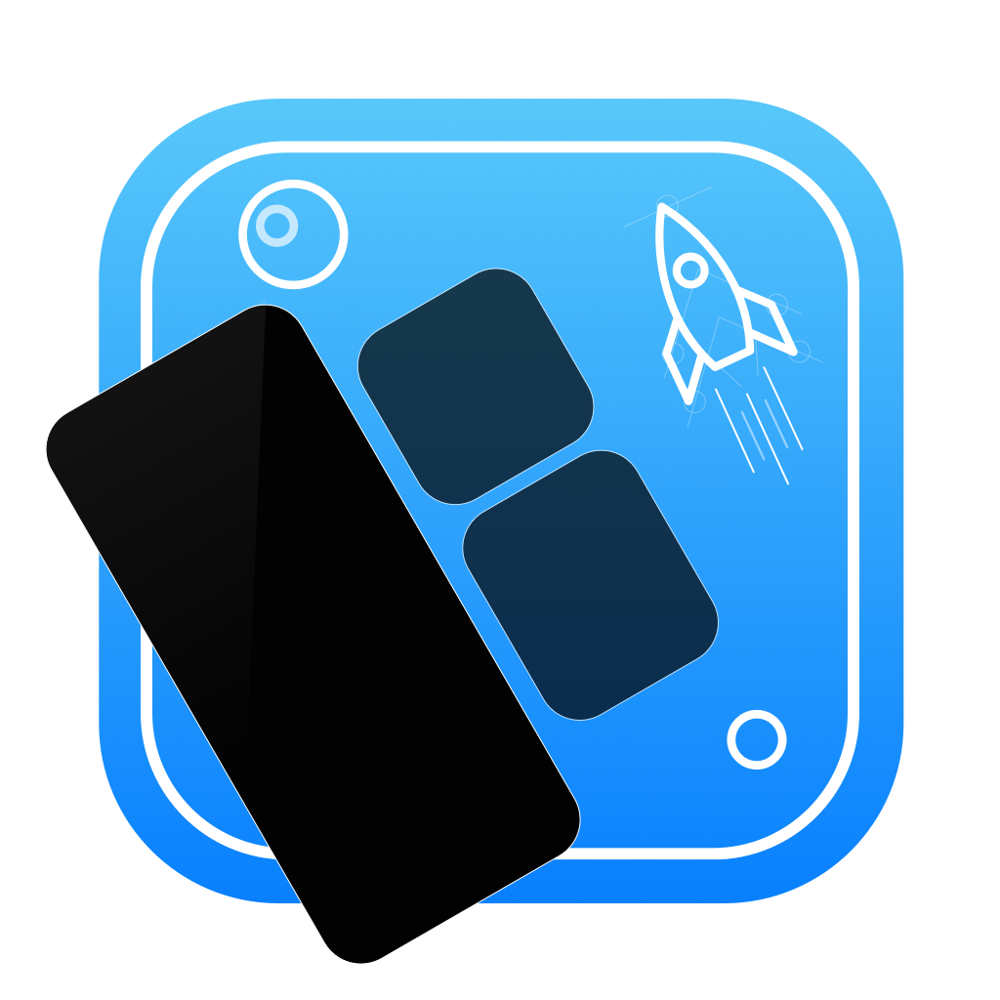

theme: Plain Jane, 0
 

---

- A monthly meetup of developers
- Part of the international CocoaHeads meetups
- Anything Apple, Cocoa, Objective-C, Swift and relevant technologies.

---

# Sponsors

  

 
 

---

---

# Win a JetBrains product coupon code

### Join us on Slack in #meetups and enter the raffle.

## Slack invite link: https://bit.ly/2zetXaO

---

# Win a RocketSim AppStore code

### Join us on Slack in #meetups and enter the raffle.

## Slack invite link: https://bit.ly/2zetXaO

---

# Agenda for today

## **From paper to AudioKit**
### Teaching math through sound - Jaap Mengers

Jaap shares the story of SenseMath: an app that lets you hear - rather than see or feel - a graph. A story about sound design, advanced VoiceOver features, and user testing in times of Corona.

---

# Next time

## 21 April 2021

### Keep an eye on our Meetup page and social media channels for more details on the talk.

---

# Reminder

- Did you download the Apple TV App yet?: cocoaheads.nl/videos
- Subscribe on YouTube: https://youtube.com/stichtingcocoaheadsnl
- New jobs on the board: https://cocoaheads.nl/jobs
- Sign up to our newsletter at https://cocoaheads.nl

See you next time!

---

