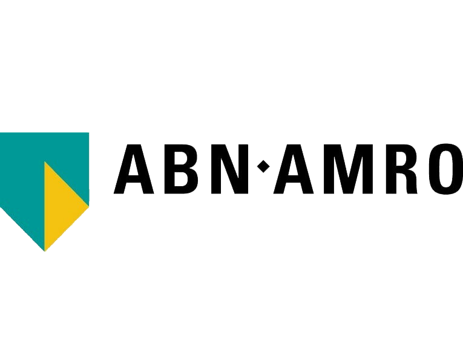

theme: Plain Jane, 0
 

---

- A monthly meetup of developers
- Part of the international CocoaHeads meetups
- Anything Apple, Cocoa, Objective-C, Swift and relevant technologies.

---

# Sponsors

  

 
 

---

---

# Win a JetBrains product coupon code

### Join us on Slack in #meetups and enter the raffle.

## Slack invite link: https://bit.ly/2zetXaO

---

# Agenda for today

## **Developing iOS Apps with an Accessibility Mindset**
## by Dani Devesa

---

# Next time

## September 2021

### Keep an eye on our Meetup page and social media channels for our next months' meetup.
### Does your company want to host a meetup in last quarter of 2021? Contact us via Slack or the website.

---

# Reminder

- Download the Apple TV App: https://cocoaheads.nl/videos
- Subscribe on YouTube: https://youtube.com/stichtingcocoaheadsnl
- New jobs on the board: https://cocoaheads.nl/jobs
- Sign up to our newsletter at https://cocoaheads.nl

See you next time!

---

