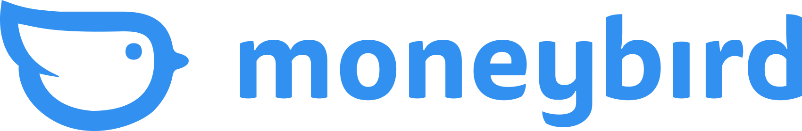
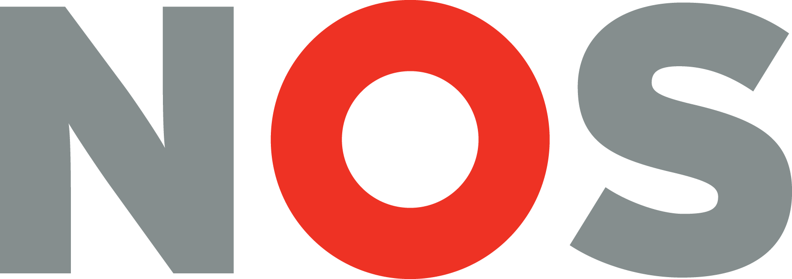

theme: Plain Jane, 0
 

---

- A monthly meetup of developers
- Part of the international CocoaHeads meetups
- Anything Apple, Cocoa, Objective-C, Swift and relevant technologies.

---

# Sponsors

  

 

---

---

# Agenda for today

- **Frameworks, libraries & packages demystified**
Mathijs Brenson

- **A Mac-tastic Indie Adventure**
Mathijs Kadijk

---

# Do you want to give a talk?

## Did you implement a nice new feature?  Or did you learn a new framework or a set of APIs? Give a talk about it!

###Contact any of the CocoaHeadsNL Team members:
####Jeroen Leenarts: @jeroen (jeroen@cocoaheads.nl) Bart Hoffman: @bart (bart@cocoaheads.nl) Marco Miltenburg: @marco (marco@cocoaheads.nl) Qing Li: @Qing Li (qingli@cocoaheads.nl)

---

# Next time

# 18 October 2023

## NOS, Hilversum

### See our Meetup page for details.

---

# Reminder

- Download the Apple TV app: https://cocoaheads.nl/videos
- Subscribe on YouTube: https://youtube.com/@CocoaHeadsNL
- New jobs on the board: https://cocoaheads.nl/jobs
- Sign up to our newsletter at https://cocoaheads.nl

See you next time!

---

