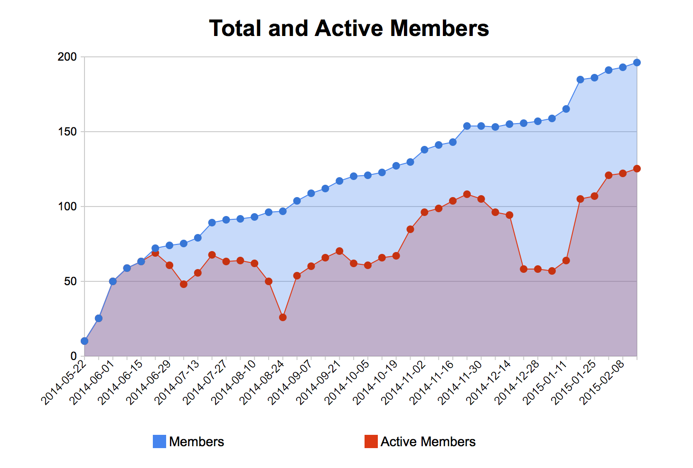

---

#Welcome

---

#Agenda
- Some announcements
- Travelbird
- Talk about rrrr by Stefan Konink
- Break
- Talk about rrrr\_cocoa\_wrapper by Berend Schotanus

---

#CocoaHeadsNL is doing great

---

---

#Yesterday we welcomed our 200th Meetup.com registration

##Thank you Pablo or Jasper
###(Not sure who was the actual nr. 200)

---

##On februari 2nd Bart, Niels and I did something

---

##Stichting cocoaheadsNL
###KVK 62569007 te Amsterdam
####A stichting is a non-profit

---

#Why?

---

#Why?
- We want to keep doing what we're doing
	- Free events with great people at cool companies
- Offer sponsors more options to support us
- Perhaps someday a conference?
- All proceeds flow back to the community

---

#Why?
- Allow sponsors to reach us the way we would like to
	- No spam
	- Opt-in
	- Tech content is king

---

###Check a (Dutch) transcript of our legal stature on:
####https://github.com/CocoaHeadsNL/legal/blob/master/Statuten%20CocoaHeadsNL.md

---
